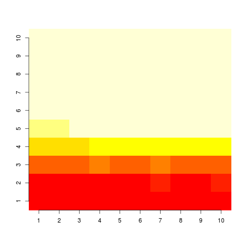

# Applying machine learning

## Background (copied from the course web site)
Using devices such as Jawbone Up, Nike FuelBand, and Fitbit it is now possible 
to collect a large amount of data about personal activity relatively 
inexpensively. These type of devices are part of the quantified self movement
a group of enthusiasts who take measurements about themselves regularly to 
improve their health, to find patterns in their behavior, or because they are 
tech geeks. One thing that people regularly do is quantify how much of a 
particular activity they do, but they rarely quantify *how well they do it*. 
In this project, we processed data from accelerometers on the belt, forearm, 
arm, and dumbell of 6 participants. They were asked to perform barbell lifts 
correctly and incorrectly in 5 different ways. More information is available 
from the website here: http://groupware.les.inf.puc-rio.br/har (see the section 
on the Weight Lifting Exercise Dataset). 

## Analysis
As the analysis is rather compute-intensive, we make use of all cores in our machine.
We first prepare for parallel processing


```r
library(doMC)
registerDoMC(cores=8)
```

We'll be using functions from the caret package to try and predict the 'classe'
of the movement - being either a correctly performed barbell lift, or one of the 5
different incorrect ways.

```r
library("caret")
```

Then we read the data. While doing so, we make sure to correctly identify all 
flavours of missing values, and have them replaced with a proper missing value in our data frame.

```r
setwd("/home/evberghe/workspace/datascience/ml/project")
datadir <- "./data"
testing <- read.table(paste(datadir, "pml-testing.csv", sep="/"), 
		sep=",", header=TRUE, na.strings=c("", "#DIV/0!", "NA"))
training <- read.table(paste(datadir, "pml-training.csv", sep="/"), 
		sep=",", header=TRUE, na.strings=c("", "#DIV/0!", "NA"))
```

Several variables are 'bookkeeping' values, information on how the measurements 
were made rather than measurements themselves, and are probably not of any 
value for makeing a correct prediction. We exclude those columns from our 
dataset.


```r
trn <- training[, -(1:7)]
```

We also noticed that there are a lot of variables that have a large fraction of missing values.
Variables seem to come in two flavours: some have no missing values, others have more than 70% missing values.
We exclude the latter from the analysis.

```r
completeness <- apply(trn, 2, function(x) mean(!is.na(x)))
trn <- trn[, completeness>0.5]
tst <- testing[, -(1:7)]
tst <- tst[, completeness>0.5]
```

Before training the model, we investigate the settings of some hyperparameters
for a Random Forest analysis.
We try different value for the minimum group size, and for the maximum number of nodes in a tree.
We do this on a small fraction of the training data, as otherwise the time to
do this becomes prohibitively long. For each of the combinations of 
parameters we train a model, and then test the accuracy of the model
on all training data not used for fitting the model.


```r
# 'eval' was set to false - takes too long to execute! 
trtfrc <- 0.025
trtidx <- sample(c(TRUE, FALSE), size=nrow(trn), 
		replace=TRUE, prob=c(trtfrc, 1-trtfrc))
trt <- trn[trtidx, ]; trv <- trn[-trtidx, ]
nodesizes <- 1:10
nodenumbers <- 2^(1:10)
accurs <- matrix(rep(NA, length(nodesizes)*length(nodenumbers)), 
		ncol=length(nodenumbers))
for(i in 1:length(nodesizes)){
	for(j in 1:length(nodenumbers)){
		fit <- train(classe~., data=trt, method="rf", 
				nodesize=nodesizes[i], maxnodes=nodenumbers[j], ntree=500)
		accurs[i, j] <- mean(predict(fit, newdata=trv)==trv$classe)
		cat(sprintf("node size: %d; number of nodes %d; out of bag %f \n", nodesizes[i], nodenumbers[j], accurs[i, j]))
	}	
}
```


We can visualise the accuracies with image(). Here lighter colours stand for higher accuracies.
The x axis corresponds to different values of minimum node size, the y values are log base 2 of the 
maximum number of nodes. Clearly we should have chosen larger values for the latter, as we didn't
go past the optimum value; in the analysis below, we recur to the default setting for this parameter. 
Also for the minimum node size, the default of 1 seems to perform best.


```r
image(accurs, axes=FALSE)
axis(1, at=(0:9)/9, labels=1:10)
axis(2, at=(0:9)/9, labels=1:10)
```

 

Now that we know the settings of our hyperparameters, we can train a model
on the full training set:


```r
fit <- train(classe~., data=trn, method="rf", ntree=500)
```

This model can now be used for prediction of test examples, using the `predict()` function:


```r
prd <- predict(fit, newdata=tst)
cat("Predictions for the test data set \n", prd)
```

```
## Predictions for the test data set 
##  2 1 2 1 1 5 4 2 1 1 2 3 2 1 5 5 1 2 2 2
```


